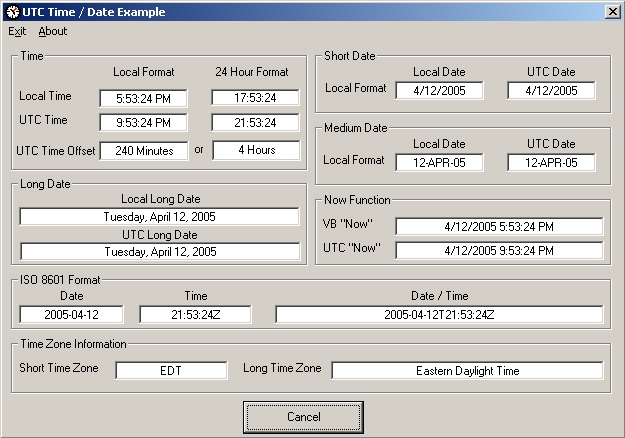

<div align="center">

## UTC Time/Date Functions  UPDATED


</div>

### Description

Updated 12-APR 2005! Add UTC time offset from Local time and formats Time / Date based on country/regional settings. Function module for getting UTC (GMT) time and date. Demo program shows how UTC functions relate to standard VB time/date functions. Being a Ham Radio and Shortwave geek, I needed UTC time a lot for logging and schedule time conversions. Comments welcome
 
### More Info
 
Returns time or date in different formats. See code in code module


<span>             |<span>
---                |---
**Submitted On**   |2005-04-12 17:54:20
**By**             |[Mark Mokoski](https://github.com/Planet-Source-Code/PSCIndex/blob/master/ByAuthor/mark-mokoski.md)
**Level**          |Beginner
**User Rating**    |5.0 (65 globes from 13 users)
**Compatibility**  |VB 5\.0, VB 6\.0
**Category**       |[VB function enhancement](https://github.com/Planet-Source-Code/PSCIndex/blob/master/ByCategory/vb-function-enhancement__1-25.md)
**World**          |[Visual Basic](https://github.com/Planet-Source-Code/PSCIndex/blob/master/ByWorld/visual-basic.md)
**Archive File**   |[UTC\_Time\_D1876034122005\.zip](https://github.com/Planet-Source-Code/mark-mokoski-utc-time-date-functions-updated__1-42098/archive/master.zip)

### API Declarations

```
Private Declare Sub GetSystemTime Lib "kernel32" (lpSystemTime As SYSTEMTIME)
Private Declare Function GetTimeZoneInformation Lib "kernel32" (lpTimeZoneInformation As TIME_ZONE_INFORMATION) As Long
Private Type SYSTEMTIME
 wYear As Integer
 wMonth As Integer
 wDayOfWeek As Integer
 wDay As Integer
 wHour As Integer
 wMinute As Integer
 wSecond As Integer
 wMilliseconds As Integer
End Type
Private Type TIME_ZONE_INFORMATION
 Bias As Long
 StandardName(32) As Integer
 StandardDate As SYSTEMTIME
 StandardBias As Long
 DaylightName(32) As Integer
 DaylightDate As SYSTEMTIME
 DaylightBias As Long
End Type
```


